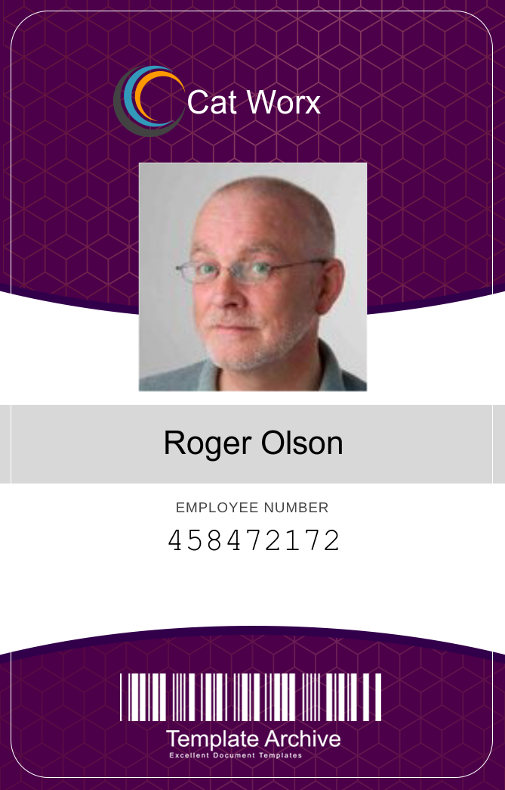

# CatWorx.BadgeMaker

## Description

This app was built for users that need to make badges for their employees. Badges will be generated after the user enters a first and last name, Id number, and photo URL for their employee. This is possible by using the System.Drawing namespace provided by the .NET framework to build the badge and render all of the employee information from the CSV file. Initially I ran into some issues setting up System.Drawing namespace due to an update that only allowed this namespace to support windows. After some research I found that I had to updated the configuration properties: see [this](https://docs.microsoft.com/en-us/dotnet/core/compatibility/core-libraries/6.0/system-drawing-common-windows-only) for more information. Currently badges are being made with "employee" data from the [Random User Generator API](https://randomuser.me/documentation) which is being used to generate ten random employees.

## Table of Contents

- [Usage](#usage)
- [Contributing](#contributing)
- [Questions](#questions)

### Usage

To run this app you will need run the following command in the CLI:

```md
dotnet run
```

This will generate 10 employee badges that look like the following:



In order to input custom employees via CLI we would need to change line 15 in Program.cs to GetEmployees() instead of GetFromApi().

### Contributing

If you would like to contribute to this app please fork the repo and submit a pull request.

### Questions

If you have any questions please reach out by going to my Github profile where you will find my email.
